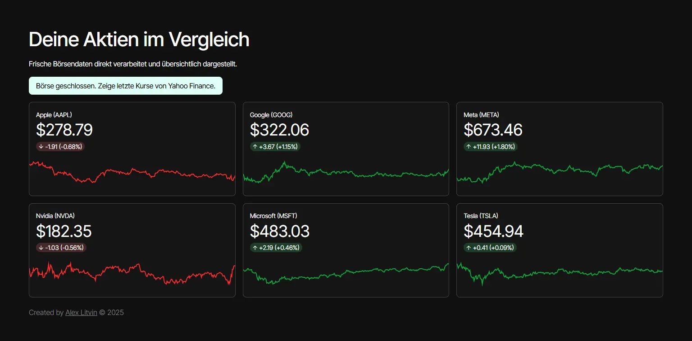
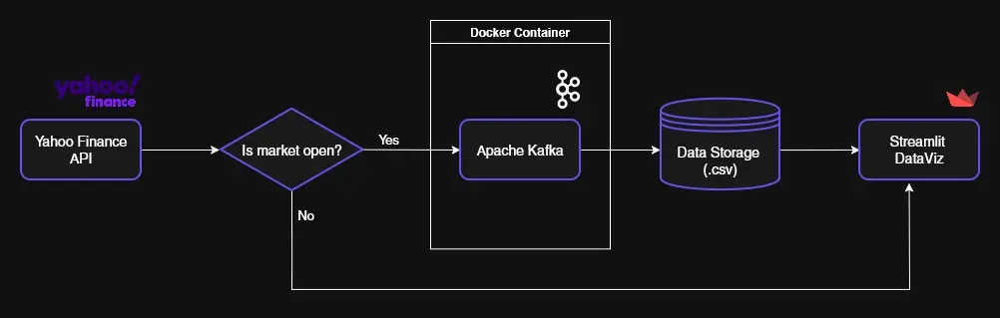

# Real-Time Stock Dashboard with Apache Kafka & Streamlit (DE)

A real-time stock dashboard built with Apache Kafka, Streamlit, and Yahoo Finance. The dashboard displays live stock prices, metrics with deltas, and falls back to historical data when the stock market is closed.


## Table of Contents

- [Tech Stack](#tech-stack)
- [Features](#features)
- [Live Demo](#live-demo)
- [Usage](#usage)
- [License](#license)
- [Credits](#credits)

## Tech Stack

- Python 3.10+
- Apache Kafka
- Streamlit
- Altair
- Yahoo Finance API (yfinance)
- Pandas / NumPy

## Features

### Real-Time Data (When Market Is Open)

- A Kafka producer fetches a stock price every 5 seconds..
- A Kafka consumer streams the latest values into the dashboard.
- Streamlit updates metrics + charts automatically.
- Delta values are calculated against previous close.

### Automatic Market-Closed Fallback

When the market is closed (weekends, holidays, after-hours):

- Kafka producer/consumer do not start.
- Dashboard loads and displays the last 300 historical values from Yahoo Finance.
  

## Usage

1. **Clone the repository:**
   ```bash
   git clone https://github.com/hhlitval/stocks-kafka-project.git
   ```

## License

This project is open-source and licensed under the [MIT License](LICENSE).

## Credits

**Designed & developed by Alex Litvin – [alexlitvin.com](https://alexlitvin.com)**
